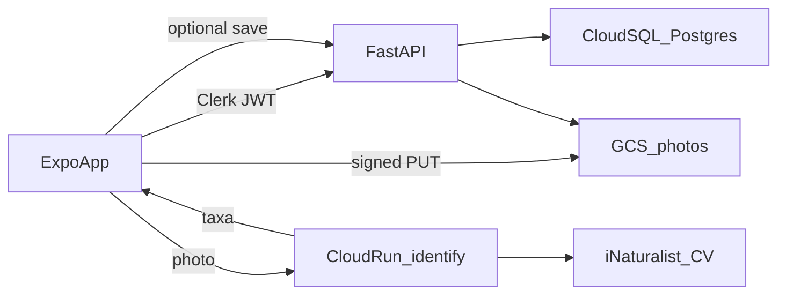

# Locations, observations, and scan

Three design memos for user places, field observations, and camera species ID.

Existing pieces: Expo list skeletons in `mobile_app/app/locations` and `mobile_app/app/observations`; FastAPI on Railway in `backend/main.py` (API key only, no user identity); tiles already in GCS (`mushroom-radar-tiles`). Auth is Clerk (`user.id` is the stable key). Scan ID uses **iNaturalist Computer Vision**, proxied on GCP so the APK never holds the iNat secret.

---

## Shared GCP foundation (all three features)

- **Cloud SQL for PostgreSQL** (one instance, one database `mushroomradar`). Relational tables, Clerk IDs as `TEXT` foreign keys. No local SQLite as source of truth.
- **GCS bucket** (new, e.g. `mushroom-radar-user-media`) for observation and scan photos. Private by default; FastAPI mints short-lived signed URLs for upload and for private reads. Public observations get a separate signed read URL or a `public/` prefix with a cached CDN URL.
- **Auth upgrade on FastAPI**: user-owned routes require `Authorization: Bearer <Clerk session JWT>`. Verify with Clerk JWKS (`CLERK_JWKS_URL` / `CLERK_ISSUER`). Keep `X-API-Key` only for existing Mushroompedia GETs if needed. Never trust a `user_id` from the client body.
- **`users` cache table**: `clerk_user_id` (PK), `email`, `created_at`, `updated_at`. Upsert on first authenticated request. Places and observations reference this id.
- **Where FastAPI lives**: keep the existing Railway service for v1; it talks to Cloud SQL (public IP + SSL, or Cloud SQL Auth Proxy in a later hardening pass) and GCS. Identify is a **separate Cloud Run** service as requested.

---

## DM 1 — My locations (saved places)

**Goal.** Each signed-in user has a private list of named places. v1 fields are the current form (name, notes) plus coordinates so a place can be used on the map later.

**Table `places`**

- `id` UUID PK
- `clerk_user_id` TEXT NOT NULL REFERENCES `users`
- `name` TEXT NOT NULL
- `notes` TEXT
- `latitude` DOUBLE PRECISION
- `longitude` DOUBLE PRECISION
- `created_at` / `updated_at` TIMESTAMPTZ

All rows are **private** (no public flag). List/get/update/delete scoped with `WHERE clerk_user_id = jwt.sub`.

**API** (FastAPI, Clerk JWT)

- `GET /api/me/places`
- `POST /api/me/places` body: `{ name, notes, latitude?, longitude? }`
- `PATCH /api/me/places/{id}`
- `DELETE /api/me/places/{id}`

**App**

- Wire `mobile_app/app/locations/index.tsx` to `GET` and render rows (name, optional coords). Empty state stays as today.
- Wire `mobile_app/app/locations/new.tsx` Save to `POST`. Capture current GPS with `expo-location` (already used on the map) as default lat/lng; user can skip if permission denied.
- Add `apiAuth()` next to `mobile_app/lib/api.ts` that attaches the Clerk token (`useAuth().getToken()`).

**Out of scope for this DM:** sharing places, folders, linking a place to observations (add `place_id` later).

---

## DM 2 — My observations

**Goal.** Users log finds with **photo, species, date, coordinates, public/private**.

**Table `observations`**

- `id` UUID PK
- `clerk_user_id` TEXT NOT NULL REFERENCES `users`
- `species_id` TEXT (catalog id, e.g. `porcini`; nullable if unknown)
- `species_name` TEXT NOT NULL (common or scientific label shown in the list)
- `scientific_name` TEXT
- `observed_on` DATE NOT NULL
- `latitude` / `longitude` DOUBLE PRECISION NOT NULL
- `is_public` BOOLEAN NOT NULL DEFAULT FALSE
- `notes` TEXT
- `photo_object` TEXT NOT NULL (GCS object key)
- `source` TEXT NOT NULL DEFAULT `manual` (`manual` | `scan`)
- `created_at` / `updated_at` TIMESTAMPTZ

Index: `(clerk_user_id, observed_on DESC)`, and `(is_public, observed_on DESC)` for a future public feed.

**Photo flow**

1. App: `POST /api/me/observations/upload-url` `{ contentType }` → `{ uploadUrl, objectKey }`.
2. App PUTs JPEG to the signed URL.
3. App `POST /api/me/observations` with species, date, coords, `is_public`, `objectKey`.
4. List cards use `GET` that includes a short-lived `photoUrl`.

**API**

- `GET /api/me/observations`
- `POST /api/me/observations/upload-url`
- `POST /api/me/observations`
- `PATCH` / `DELETE` by id (owner only)
- Optional later: `GET /api/observations/public` (only `is_public = true`)

**App**

- `mobile_app/app/observations/index.tsx`: list with thumbnail, species, date.
- `mobile_app/app/observations/new.tsx`: species picker (existing mushroom JSON), date, notes, public toggle, photo via `expo-image-picker`, GPS via `expo-location`, then upload + create.
- Default `is_public` to **false**. Show a clear toggle so users do not publish coordinates by accident.

**Privacy.** Private photos stay in a non-public GCS prefix. Public rows still should not leak exact coords in a global feed until you explicitly want that; the flag is stored now, public list API can wait.

---

## DM 3 — Scan mode (camera + iNaturalist)

**Goal.** Side menu **Scan mode** opens the camera. The photo goes to a GCP service that calls iNaturalist Computer Vision and returns ranked species. User can discard or save as an observation (`source = scan`).

**Cloud Run `identify`**

- Region near users (e.g. `europe-west1`).
- Endpoint `POST /identify` with multipart image (max size cap, e.g. 8 MB).
- Server calls iNaturalist `POST /v1/computervision/score_image` with a stored `INATURALIST_API_TOKEN`.
- Response to the app: top N results `{ taxonId, scientificName, commonName, score, iconicTaxon }`, filtered to fungi when iNat provides `iconic_taxon_name` / `Fungi`.
- Auth: same Clerk JWT (or a short-lived token issued by FastAPI) so the service is not a public open proxy.
- Timeouts, rate limit per `clerk_user_id`, no image persistence on Cloud Run (optional: write a copy to GCS only if the user saves).

**App**

- New menu item in `mobile_app/components/side-menu.tsx`: **Scan mode** → `/scan`.
- New `mobile_app/app/scan.tsx`: `expo-camera` shutter, preview, send, result list.
- Result screen: pick a taxon → prefill New observation (species, photo, GPS, date = today, `source=scan`) or “Save observation” in one tap.
- Camera permission copy in `app.json` (`NSCameraUsageDescription` / Android CAMERA).

**Limits to call out.** iNat CV is a third-party model: rate limits, ToS, not a guarantee of edibility. UI must say predictions are not foraging advice (same disclaimer as the map).

---

## Implementation order

1. GCP project: Cloud SQL + GCS + Cloud Run identify (empty handler).
2. FastAPI: Clerk JWT, `users` + `places` + `observations`, signed uploads.
3. Mobile: locations CRUD, then observations (picker + photo + public toggle).
4. Scan screen + Cloud Run → iNat; save-as-observation reuse DM 2 APIs.

No Alembic in the repo today: add SQLAlchemy (or asyncpg) + a small migration folder under `backend/`.

---

## Implementation todos

1. Provision Cloud SQL Postgres, GCS user-media bucket, and Clerk JWT verification on FastAPI.
2. `places` table + `/api/me/places` CRUD; wire My locations list/new (name, notes, GPS).
3. `observations` table + signed photo upload; wire My observations with species, date, coords, public toggle.
4. Scan mode camera screen + Cloud Run iNaturalist CV proxy; optional save as observation.
